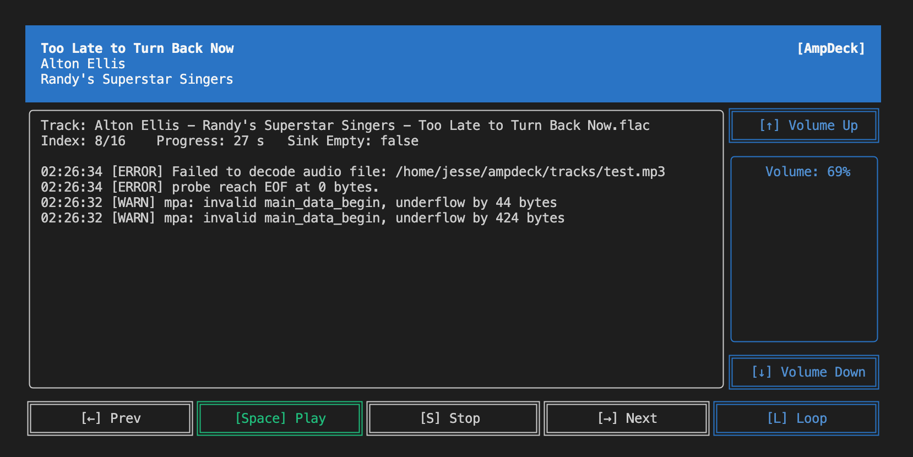

# AmpDeck
```
 _____           ____          _   
|  _  |_____ ___|    \ ___ ___| |_ 
|     |     | . |  |  | -_|  _| '_|
|__|__|_|_|_|  _|____/|___|___|_,_|
            |_|                                               
```

The simple audio player written (poorly) in Rust. `.mp3`, `wav`, and `.flac` files are supported.



## Install

Download the latest release from the `release` directory. Be sure you have a `Settings.toml` file in the same directory as the executable. This file is used to configure the application settings.

### Raspberry Pi
```bash
wget https://github.com/jesse-stewart/ampdeck/raw/main/release/aarch64-unknown-linux-gnu/ampdeck
```

### MacOS
```bash
wget https://github.com/jesse-stewart/ampdeck/raw/main/release/x86_64-apple-darwin/ampdeck
```

### Windows (64-bit)
Just download the executable and config file from the link below and place them in the same directory.
```bash
https://github.com/jesse-stewart/ampdeck/raw/main/release/x86_64-pc-windows-gnu/ampdeck.exe
https://github.com/jesse-stewart/ampdeck/raw/main/release/Settings.toml
```

### Settings.toml

Create/modify the `Settings.toml` file in the same directory as the executable. Open the file with your favorite text editor and add the following configuration:

```bash
touch Settings.toml
sudo nano Settings.toml
```

```toml
music_directory = "./tracks"
continue_session = true
```

the `continue_session` setting is used to determine if the application should continue playing the last track when the application is restarted. If `continue_session` is set to `false`, the application will start playing the first track in the `music_directory`.

### Upload audio files
Upload audio files to `music_directory`. Currently only supports `.mp3`, 'wav', and `.flac` files. Sorry `.m4a` and `.ogg` files, you aren't invited.

```bash
mkdir tracks
cp /path/to/audio/files/* tracks/
```

## Usage

Run the application with the following command:

```bash
./ampdeck
```

- `Space` - Play/Pause
- `Right Arrow` - Next Track
- `Left Arrow` - Previous Track
- `Up Arrow` - Volume Up
- `Down Arrow` - Volume Down
- `Q` - Quit
- `L` - Loop Playlist


# Development

```text
release/
├── ampdeck        -> compiled application
└── Settings.toml  -> settings configuration
src/
├── app.rs         -> holds the state and application logic
├── audio.rs       -> handles playing and stopping audio
├── event.rs       -> handles the terminal events (key press, mouse click, resize, etc.)
├── handler.rs     -> handles the key press events and updates the application
├── lib.rs         -> module definitions
├── main.rs        -> entry-point
├── meta.rs        -> get the metadata of audio files
├── tui.rs         -> initializes/exits the terminal interface
└── ui.rs          -> renders the widgets / UI
Settings.toml      -> settings configuration for dev
```

## Dev Environment

### Install Rust
```bash
curl --proto '=https' --tlsv1.2 -sSf https://sh.rustup.rs | sh
```

I don't know, maybe some other stuff, figure it out.

### Create Settings.toml

Be sure you have a `Settings.toml` file in the root directory. This file is used to configure the application settings.
```toml
music_directory = "./tracks"
```

### Upload audio files

Right now it just walks the `music_directory` and plays the first audio file it finds. So, upload some audio files to `music_directory`.

```bash

### Run dev
```bash
cargo run
```

### Build release
```bash
cargo build --release
```
